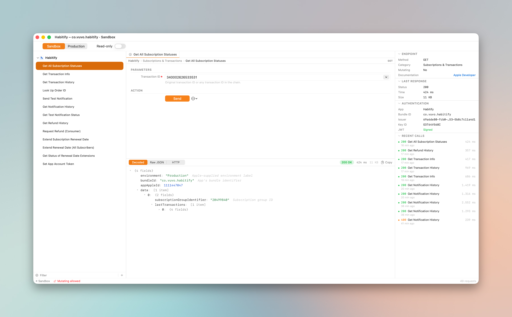

<h1 align="center">Peel</h1>

<p align="center">
  <strong>The App Store Server API workbench for Mac.</strong><br>
  Native · Open-source · Built by <a href="https://galva.io">Galva</a>.
</p>

<p align="center">
  <a href="https://github.com/galva/peel/releases/latest"></a>
  <a href="https://github.com/galva/peel/actions/workflows/ci.yml"></a>
  <a href="LICENSE"></a>
  
</p>

<p align="center">
  
</p>

## Why

iOS subscription debugging usually starts with a `.p8` key, ends with a 30-minute round trip through Postman or a one-off Python script, and produces a pretty-printed-JSON screenshot pasted into a Linear ticket.

Peel collapses the round trip into one keystroke: paste key, pick endpoint, send, read the decoded response. The whole `signedPayload` → `signedTransactionInfo` → `signedRenewalInfo` JWS tree is unwrapped inline. Apps live in the sidebar, parameters in an Xcode-style inspector form, history one keystroke away.

## Features

- **Full coverage of the App Store Server API.** 13 endpoints from `getAllSubscriptionStatuses` to `extendSubscriptionRenewalDateForAllActiveSubscribers`. New endpoints take one file to add.
- **Nested JWS auto-decode.** Every `signedPayload`, `signedTransactionInfo`, `signedRenewalInfo` is unwrapped inline. Heavy responses render in a `WKWebView` so 5,000-transaction payloads stay smooth.
- **Confirmation gates for destructive calls.** Refunds, renewal extensions, and the mass-extend endpoint all surface a pre-dispatch sheet showing the wire values, the environment, and the customer-facing consequence. Production calls paint the prompt red.
- **App Store metadata fetch.** Paste an App Store URL or bundle id; Peel auto-fills display name, bundle id, and icon via Apple's iTunes Lookup API.
- **Automatic pagination.** `getNotificationHistory` exposes a "how many to fetch" field — Peel walks Apple's `paginationToken` chain and merges the batches into one response.
- **Smart input controls.** Date pickers for time windows, dropdowns for `refundPreference` / `extendReasonCode`, searchable tag picker for storefront country codes, autocomplete on transaction-id fields backed by your call history.
- **Local webhook receiver.** `sendTestNotification` → arrives on `127.0.0.1` → decoded in the same UI as any API response.
- **Compare mode.** Diff two responses with a semantic summary card ("subscription extended by 30 days").
- **Replayable history.** Recent calls across all endpoints in the Inspector — click any row to re-hydrate the request form and response viewer with no network call.
- **App-sandboxed, Keychain-only secrets, hard-coded network allowlist.** Nothing leaves your machine except calls to Apple.

## Install

### Download a release

The fastest path: grab the latest signed DMG from [**Releases**](https://github.com/galva/peel/releases/latest).

```bash
# Or with the gh CLI
gh release download --repo galva/peel --pattern '*.dmg'
```

Open the DMG and drag `Peel.app` into `Applications`.

For unsigned development builds (open-source CI artifacts), macOS may flag the app on first launch. Right-click → Open once, or run:

```bash
xattr -dr com.apple.quarantine /Applications/Peel.app
```

### Homebrew

```bash
# Coming soon — track https://github.com/galva/peel/issues for status
brew install --cask peel
```

### Build from source

Requires **macOS 14+**, **Xcode 16+**, and optionally **[Tuist 4](https://tuist.io)** if you want a real `.xcodeproj` to develop against. Without Tuist the SPM path still works for command-line builds.

```bash
git clone https://github.com/galva/peel.git
cd peel

# Option A — pure SPM
swift test                     # 79 tests, < 1 s
./scripts/bundle.sh release    # produces build/Peel.app
open build/Peel.app

# Option B — Xcode via Tuist (recommended for development)
brew install tuist
tuist generate                 # produces Peel.xcworkspace
open Peel.xcworkspace          # ⌘R to run
```

Both paths read the same `Sources/` and `Tests/` directories; pick whichever fits your workflow. CI uses Option A.

## Trust model

Peel is local-only and the source is open so you can verify it.

| Threat | Mitigation |
|---|---|
| Key exfiltration | `.p8` keys stored in macOS Keychain (`AccessibleAfterFirstUnlockThisDeviceOnly`, `Synchronizable = false`). Never written to disk in plaintext. |
| Accidental production action | Read-only on by default. Toggling it off in Production triggers a confirmation. Mutating endpoints surface a pre-dispatch sheet showing exact wire values. |
| Network exfiltration | Hard-coded host allowlist (Apple's App Store Server API hosts, the iTunes Lookup API for icons, and Galva's Sparkle update host). Anything else fails closed in-process. |
| Audit log leak | Sensitive parameters are redacted at write time; the log lives locally and never transmits. |
| Supply chain | Zero third-party Swift dependencies. The graph is the standard library plus Apple frameworks. |

Details in [SECURITY.md](SECURITY.md).

## Project layout

```
Package.swift          SPM manifest — canonical for swift build / swift test
Project.swift          Tuist manifest — generates Peel.xcodeproj on demand
Sources/
  PeelCore/            Models, JWT signer, Keychain, JWS decoder, JSON tree, diff,
                       anonymizer, country catalog, HTML renderer, example factory
  PeelAPI/             Endpoint catalog, request builder, HTTP client, confirmation
                       descriptors, notification-type and reason-code tables
  PeelPersistence/     SwiftData entities, history, audit log, file blobs
  PeelWebhook/         Local NWListener HTTP receiver bound to 127.0.0.1 only
  PeelUI/              SwiftUI views — sidebar, request panel, response viewer,
                       inspector, status bar, sheets
  PeelApp/             AppKit shell — AppDelegate, main menu, window controllers
Tests/                 Unit tests per layer, run via `swift test`
scripts/bundle.sh      SPM → .app bundling helper (also invoked by Release CI)
Resources/             Info.plist, Peel.entitlements
.github/workflows/     ci.yml (PR builds), release.yml (tagged DMG releases)
docs/                  Architecture, app icon spec, release runbook
```

## Contributing

PRs welcome. Each layer is its own SPM target with its own test target, so adding a new endpoint is usually ~3 files. See [CONTRIBUTING.md](CONTRIBUTING.md) for the workflow.

## License

MIT — see [LICENSE](LICENSE).

## Built by

[Galva](https://galva.io), the team behind [Habitify](https://habitify.me).
